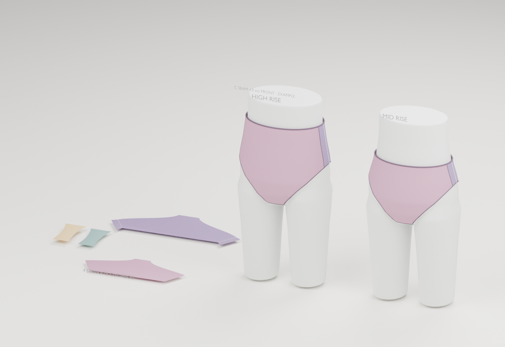

# 小尺 · 三角内裤打版工作室

在线使用：[打开小尺](https://syzhaoln-stack.github.io/xiaochi-underwear-studio/)

中腰／高腰女士三角内裤的尺寸计算、结构演示与试裁工具。支持固定尺码表与实测腰臀围两种入口，浏览器即可使用。

- 可旋转的 Blender 展示模特，支持穿着、结构拆解、四片平铺。
- 参数变化同步更新前后片、裆片、详细尺寸与松紧带裁长。
- 左右 C 拼缝可从原正侧线向前移；前片窄翼转给后片，纸样和三维同步更新。3 cm 仅为演示，一指半请实测。
- 腿口可整圈均匀分配，也可按前片／裆侧／后片设置比例，给出接好带后的 A/B 记号。
- 导出详细尺寸单、当前参数和带 10 cm 校准框的 1:1 SVG。
- 方案保存在当前浏览器，尺寸和备注不会上传服务器。



## 使用和试裁

固定尺码与预填比例是可修改的演示数据。纸样为参数化试裁模板，须用实际面料、松紧带试缝与试穿校正；3D展示款式和拼接关系，不进行布料物理仿真。

详见[使用说明](使用说明.md)。Blender源场景在[assets/briefs-demo.blend](assets/briefs-demo.blend)，网页展示人台在[assets/mannequin.glb](assets/mannequin.glb)。

## 本地开发

需要 Node.js 22 或更新的兼容版本。

```text
npm ci
npm run dev
```

`npm test` 验证纸样几何与计算；`npm run build` 生成 `dist/`。

## 网页发布

推送到 `main` 后，GitHub Actions 运行计算验证与构建，并部署到 GitHub Pages。构建使用相对资源路径，支持仓库子目录。
